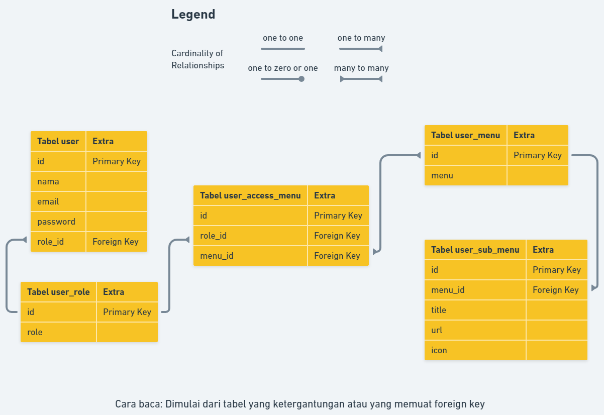

### Dependency

-   yarn
-   php
-   mysql
-   git

### Cara install

-   Clone atau download repository ini:

```sh
git clone https://github.com/armandwipangestu/beasiswa.git
```

-   Install dependencies template stisla

```sh
cd beasiswa/template/stisla
```

```sh
yarn
```

```sh
yarn dist
```

-   Import Database

    -   Membuat database baru dengan nama `beasiswa`

        

    -   Import `beasiswa/database/beasiswa.sql` ke dalam database melalui phpmyamdin

        
        
        

-   Membuka program

Buka url `localhost/beasiswa` maka program akan muncul seperti berikut ini


Untuk login dapat membuat akun sendiri atau menggunakan akun berikut ini:

-   Role Admin

    -   Email: admin@admin.com
    -   Password: 123

    

-   Role User

    -   Email: user@user.com
    -   Password: 123

    

### ERD (Entity Relationship Diagram)



Penjelasan:

-   Tabel `user` dan tabel `user_role`:

    -   Jenis relasi: Many-to-One (Banyak-ke-Satu)
    -   Penjelasan: Setiap user hanya memiliki satu role, tetapi satu role dapat dimiliki oleh banyak user

-   Tabel `user_access_menu` dan tabel `user_role`:

    -   Jenis Relasi: Many-to-One (Banyak-ke-Satu)
    -   Penjelasan: Setiap entri dalam tabel `user_access_menu` terkait dengan satu role, tetapi satu role dapat memiliki banyak entri dalam tabel `user_access_menu`

-   Tabel `user_access_menu` dan tabel `user_menu`:

    -   Jenis relasi: Many-to-Many (Banyak-ke-Banyak)
    -   Penjelasan: Satu entri dalam tabel `user_access_menu` dapat terkait dengan banyak menu, sebaliknya satu menu dapat terkait dengan banyak entri dalam tabel `user_access_menu`

-   Tabel `user_sub_menu` dan tabel `user_menu` :

    -   Jenis relasi: Many-to-One (Banyak-ke-Satu)
    -   Penjelasan: Setiap submenu terkait dengan satu menu, tetapi satu menu dapat memiliki banyak submenu.
