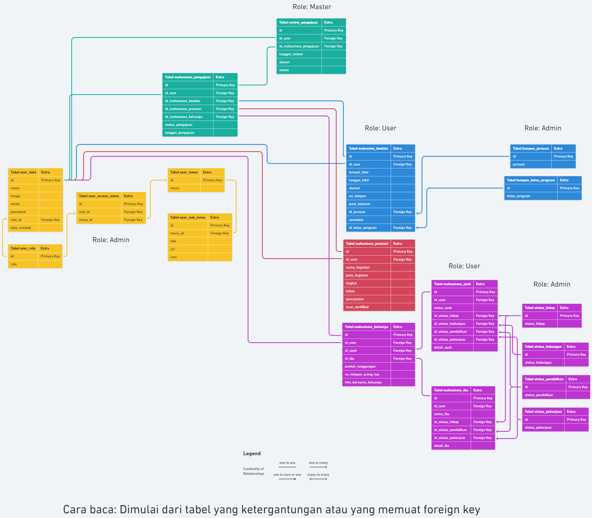

<h1 align="center">Mini Project 2 - Beasiswa</h1>


## Daftar Isi

- [Pendahuluan](#pendahuluan)
- [Teknologi Yang Digunakan](#teknologi-yang-digunakan)
- [Dependency](#dependency)
- [Cara Install](#cara-install)
- [Membuka Program](#membuka-program)
    - [List User](#list-user)
- [ERD (Entity Relationship Diagram)](#erd-entity-relationship-diagram)
- [Penjelasan Role](#penjelasan-role)

## Pendahuluan

Repository ini merupakan tugas dari mata kuliah Mini Project 2, pada tugas kali ini saya [Arman Dwi Pangestu](https://github.com/armandwipangestu/) dengan [Azizan Artiandi Akbar Fauzi](https://github.com/Jijan5) mendapatkan tugas dengan judul `Aplikasi pencatatan pengajuan penerima beasiswa Yayasan stmik bandung` yang dimana aplikasi tersebut harus memiliki fitur berikut ini:

- Proses Registrasi
- Proses Report Pemohon
- Filter Pemohon
- Seleksi Penerima Beasiswa
- Report Hasil Penerimaan

## Teknologi Yang Digunakan

Aplikasi ini dibuat menggunakan beberapa teknologi, diantaranya adalah:

> **Catatan**:
>
> -   `Codeigniter` disini berfungsi sebagai framework backend
>
> -   `Stisla` berfungsi sebagai template dari framework frontend yaitu `Bootstrap`

-   [Codeigniter Versi 3.1.13](https://codeigniter.com/userguide3/installation/downloads.html)
-   [Stisla Versi 2.2.0](https://github.com/stisla/stisla/releases/tag/v2.2.0)
-   [Bootstrap Versi 4.2.1](https://blog.getbootstrap.com/2018/12/21/bootstrap-4-2-1/)
-   [jQuery Versi 3.3.1](https://blog.jquery.com/2018/01/20/jquery-3-3-1-fixed-dependencies-in-release-tag/)
-   [Datatables Versi 1.13.4](https://cdn.datatables.net/1.13.4/)
-   [Sweetalert Versi 11.7.12](https://github.com/sweetalert2/sweetalert2/releases/tag/v11.7.12)
-   [PHP Dotenv for Codeigniter](https://github.com/agungjk/phpdotenv-for-codeigniter)
-   [Dompdf](https://github.com/dompdf/dompdf/)

## Dependency

> **Catatan**:
>
> -   `Composer` disini berfungsi sebagai package manager untuk mendownload dependency dari `dompdf`.
>
> -   `Yarn` disini berfungsi sebagai package manager untuk mendownload dependency dari template `Stisla`.
>
> -   Untuk PHP, MySQL dan Apache bisa di install dengan bundle seperti `XAMPP` / `MAMP` / `LAMP`
>
> -   `Git` berfungsi untuk melakukan clone atau mendownload repository ini

-   [Composer](https://getcomposer.org/download/)
-   [Yarn](https://yarnpkg.com/)
-   [PHP 5 ~ 8.0](https://www.php.net/releases/8.0/en.php)
-   [MySQL 5.1+](https://downloads.mysql.com/archives/community/)
-   [Apache](https://httpd.apache.org/)
-   [Git](https://git-scm.com/downloads)

## Cara Install

<details open>
<summary><strong>Clone atau Download Repository ini</strong></summary>

> **Catatan**:
>
> Simpan folder beasiswa di lokasi `xampp/htdocs`

```sh
git clone https://github.com/armandwipangestu/beasiswa.git
```

</details>

<details>
<summary><strong>Membuat file <code>.env.development</code></strong></summary>

```sh
cd beasiswa
```

```sh
cp .env.example .env.development
```

> **Catatan**:
>
> Sesuaikan isian .env.development dengan konfigurasi anda (seperti nama database dll)
>
> Default yang saya gunakan:
> ```
> DB_HOSTNAME=localhost
> DB_USERNAME=root
> DB_PASSWORD=
> DB_NAME=beasiswa
> ```

</details>

<details>
<summary><strong>Install dependencies dompdf</strong></summary>

```sh
composer update
```

</details>

<details>
<summary><strong>Install dependencies template stisla</strong></summary>

```sh
cd template/stisla
```

```sh
yarn
```

```sh
yarn dist
```

</details>

<details>
<summary><strong>Import Database</strong></summary>

-   Membuat database baru dengan nama `beasiswa`

    

-   Import `beasiswa/database/beasiswa.sql` ke dalam database melalui phpmyamdin

    
    
    

</details>

## Membuka program

Buka url `localhost/beasiswa` maka program akan muncul seperti berikut ini


Untuk login dapat membuat akun sendiri atau menggunakan akun berikut ini:

### List User

-   Role Admin

    -   Email: admin@admin.com
    -   Password: 123

    

-   Role User

    -   Email: user@user.com
    -   Password: 123

    -   Email: user2@user2.com
    -   Password: 123

    

- Role Master

    -   Email: master@master.com
    -   Password: 123

    

## ERD (Entity Relationship Diagram)



Untuk melihat ERD dari program ini, kunjungi halaman berikut ini [whimsical.com/tabel-keseluruhan](https://whimsical.com/tabel-keseluruhan-UbTUmg9vvBiZaeJ61G8pQR)

## Penjelasan Role

- `Admin`

    Role ini dapat mengatur (menambah, menghapus, mengubah) role akses, role user, jurusan, kelas program, menu management, submenu management, status hidup, status hubungan, status pendidikan, status pekerjaan.

    Singkatnya role ini yang bertanggung jawab untuk data data yang mempunyai relasi.

- `User`

    Role ini hanya dapat mengisikan dokumen beasiswa sebagai syarat untuk mengajukan beasiswa, dokumen beasiswa ini mencakup dokumen biodata user, prestasi, data keluarga.

    Dokumen - dokumen tersebut akan menjadi bahan penilaian dalam pengecekan dokumen untuk diterima atau ditolak nya beasiswa oleh role `Master`.

- `Master`

    Role ini dapat mem-filter dokumen beasiswa yang diajukan, di role inilah dokumen beasiswa akan dicek. Kemudian nantinya dokumen tersebut akan dikembalikan ke role `User` dengan status diterima atau ditolak.